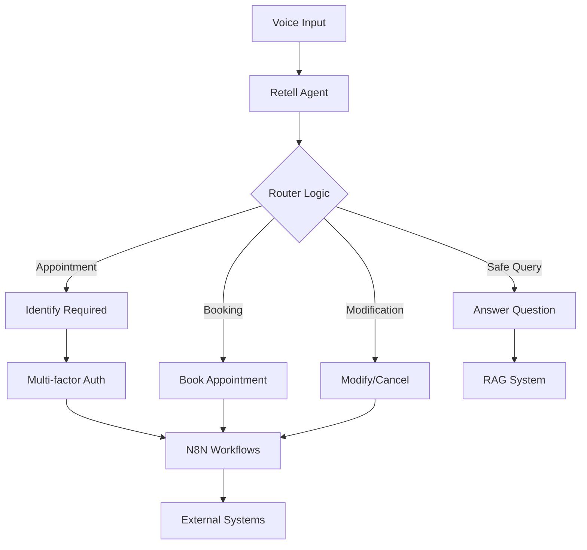

# Layer 7 AI Voice Receptionist 🤖

A sophisticated AI voice receptionist system with PII protection and automated workflows.

## 🚀 Build System

This project includes an automated build system that optimizes and minifies configuration files for production use.

### Quick Start

```bash
# Install dependencies
npm install

# Build optimized files
npm run build

# Clean build directory
npm run clean

# Format code
npm run format
```

### 📁 Project Structure

```
├── Layer 7 AI Voice Receptionist (POC) - Retell Agent.json  # Main agent config
├── prompts/                                                 # AI prompts & instructions
│   ├── Core Prompt.md                                      # Main agent instructions
│   └── RAG Agent Prompt - answerQuestion.md               # RAG security prompt
├── n8n/                                                    # N8N workflow automations
│   ├── answerQuestion.json                                # Question handling
│   ├── bookAppointment.json                              # Appointment booking
│   ├── cancelAppointment.json                            # Appointment cancellation
│   ├── identifyAppointment.json                          # Appointment lookup
│   ├── logLead.json                                      # Lead management
│   └── modifyAppointment.json                            # Appointment modification
├── .github/workflows/                                      # CI/CD automation
│   └── build-deploy.yml                                   # Build & release pipeline
├── dist/                                                   # Optimized build output
├── build.js                                              # Build system
├── package.json                                           # Dependencies & scripts
├── .prettierrc                                           # Code formatting rules
└── .gitignore                                            # Git exclusions
```

## 🔧 Build Features

### ✨ Optimization
- **JSON Minification**: Removes whitespace and formatting from JSON files
- **Markdown Formatting**: Standardizes markdown formatting 
- **Size Reduction**: Typically achieves 30-40% size reduction
- **Build Analytics**: Detailed build statistics and file size reports

### 🔄 CI/CD Pipeline

The project includes GitHub Actions for automated builds and releases:

1. **Build Stage**: 
   - Installs dependencies with `npm install`
   - Runs code formatting with Prettier
   - Builds optimized files with comprehensive scanning
   - Generates detailed build statistics

2. **Release Stage**: 
   - Creates timestamped GitHub releases
   - Bundles optimized files as release assets
   - Auto-tags releases with `v{version}-{timestamp}`
   - Makes distributions available for download

3. **Optimization Features**:
   - Recursive directory scanning
   - Multi-file type processing (JSON, Markdown)
   - Metadata preservation
   - Error handling for malformed files

### 📊 Build Output

The build process generates:
- **Minified JSON files**: Production-ready configurations
- **Formatted Markdown**: Standardized documentation
- **Build info**: Detailed statistics in `dist/build-info.json`

Example build info:
```json
{
  "buildTime": "2025-10-01T14:35:17.236Z",
  "version": "1.0.0", 
  "stats": {
    "totalFiles": 11,
    "originalSize": "71.19 KB",
    "processedSize": "45.63 KB", 
    "totalReduction": "35.9%",
    "processingTime": "112ms"
  }
}
```

## 🧩 Components & Architecture

### Core Components

#### 🤖 Retell Agent Configuration
- **File**: `Layer 7 AI Voice Receptionist (POC) - Retell Agent.json`
- **Purpose**: Main conversation flow and routing logic
- **Features**: 
  - Multi-step conversation routing
  - Context-aware response handling
  - PII-safe query filtering
  - Tool integration for appointments

#### 📝 Prompt Engineering
- **Directory**: `prompts/`
- **Core Prompt**: System instructions and personality
- **RAG Prompt**: Secure information retrieval guidelines
- **Security Focus**: Prevents data leakage and ensures compliance

#### ⚙️ N8N Workflows
- **Directory**: `n8n/`
- **Functions**: Complete appointment lifecycle management
- **Integrations**: External calendar systems, CRM tools
- **Automation**: Lead capture, booking, modifications, cancellations

### 🔄 Workflow Architecture



### 🛠️ Available Scripts

| Script | Purpose | Usage |
|--------|---------|-------|
| `npm run build` | Build optimized files | Production deployment |
| `npm run clean` | Remove build artifacts | Clean slate rebuilds |
| `npm run rebuild` | Clean + build | Complete refresh |
| `npm run format` | Format all code | Code consistency |
| `npm run format:check` | Check formatting | CI/CD validation |

## 🛡️ Security Features

- **PII Protection**: Router-level filtering prevents exposure of personal data
- **Multi-factor Authentication**: Required for appointment access
- **Secure RAG**: Bulletproof prompts prevent data leakage
- **Secrets Management**: `.gitignore` configured to exclude sensitive files

## 🔗 Resources & Links

### 📁 Repository Access
- **GitHub Repository**: https://github.com/raulduk3/layer7-ai-voice
- **Latest Releases**: https://github.com/raulduk3/layer7-ai-voice/releases
- **Build Artifacts**: Downloadable from releases
- **Actions History**: https://github.com/raulduk3/layer7-ai-voice/actions

### 📊 Monitoring & Analytics
- **Build Statistics**: Available in `dist/build-info.json`
- **Performance Metrics**: File size reductions, processing times
- **Release Tags**: Timestamped versions for tracking
- **Workflow Status**: Real-time CI/CD pipeline monitoring

## 🛠️ Development

### 🚀 Getting Started

1. **Clone Repository**:
   ```bash
   git clone https://github.com/raulduk3/layer7-ai-voice.git
   cd layer7-ai-voice
   ```

2. **Install Dependencies**:
   ```bash
   npm install
   ```

3. **Run Initial Build**:
   ```bash
   npm run build
   ```

### 🔧 Adding New Features

#### Extending Build System
The build system supports multiple file types and processing modes:

1. **Add File Type Support**:
   - Modify `scanDirectory()` in `build.js`
   - Add processing logic in `processFile()`
   - Update file extension filters

2. **Custom Optimization**:
   - Extend JSON minification logic
   - Add new Prettier configurations
   - Implement custom file transformations

#### N8N Workflow Development
1. **Create New Workflow**:
   - Design workflow in N8N interface
   - Export as JSON to `n8n/` directory
   - Test integration with agent configuration

2. **Agent Integration**:
   - Add tool definition to agent JSON
   - Configure router edges for new functionality
   - Update security prompts as needed

### 🐛 Troubleshooting

#### Common Issues

| Issue | Cause | Solution |
|-------|-------|----------|
| Build fails | Malformed JSON | Check file syntax, use JSON validator |
| CI/CD errors | Missing dependencies | Verify `package.json` and lock file |
| Large file sizes | No optimization | Ensure Prettier is configured correctly |
| Security warnings | PII exposure | Review router logic and prompts |

#### Debug Commands

```bash
# Validate JSON files
find . -name "*.json" -exec node -e "JSON.parse(require('fs').readFileSync('{}', 'utf8'))" \;

# Check build output
npm run build && ls -la dist/

# Verify formatting
npm run format:check

# Clean rebuild
npm run clean && npm run build
```

### ⚙️ Advanced Configuration

#### Environment Variables
- `NODE_ENV`: Set build environment (development/production)
- `BUILD_VERBOSE`: Enable detailed build logging
- `SKIP_MINIFY`: Disable minification for debugging

#### Prettier Customization
```json
{
  "semi": false,
  "singleQuote": true,
  "tabWidth": 2,
  "trailingComma": "es5",
  "printWidth": 100
}
```

#### Build Script Options
- **Selective Processing**: Target specific directories
- **Custom Exclusions**: Add to excluded directories list
- **Performance Tuning**: Adjust processing batch sizes

## 🤝 Contributing

### Development Workflow
1. Fork the repository
2. Create a feature branch: `git checkout -b feature/amazing-feature`
3. Make your changes and test thoroughly
4. Run formatting: `npm run format`
5. Commit changes: `git commit -m 'Add amazing feature'`
6. Push to branch: `git push origin feature/amazing-feature`
7. Open a Pull Request

### Code Standards
- **Formatting**: Prettier with provided configuration
- **JSON**: Valid syntax, logical structure
- **Security**: No hardcoded secrets, PII protection
- **Documentation**: Update README for significant changes

### Testing Checklist
- [ ] Build completes successfully (`npm run build`)
- [ ] All files process without errors
- [ ] Security prompts are intact
- [ ] Agent configuration is valid
- [ ] CI/CD pipeline passes

## 📚 Additional Resources

### � Related Documentation
- [Retell AI Documentation](https://docs.retellai.com/)
- [N8N Workflow Documentation](https://docs.n8n.io/)
- [Prettier Configuration Guide](https://prettier.io/docs/en/configuration.html)
- [GitHub Actions Documentation](https://docs.github.com/en/actions)

### 🛟 Support & Community
- **Issues**: [GitHub Issues](https://github.com/raulduk3/layer7-ai-voice/issues)
- **Discussions**: [GitHub Discussions](https://github.com/raulduk3/layer7-ai-voice/discussions)
- **Wiki**: [Project Wiki](https://github.com/raulduk3/layer7-ai-voice/wiki)

### 📋 Roadmap
- [ ] Enhanced PII detection algorithms
- [ ] Multi-language support
- [ ] Advanced analytics dashboard
- [ ] Plugin system for custom integrations
- [ ] Voice quality optimization
- [ ] Real-time monitoring tools

## 📄 License

ISC License - See repository for details.

## 🏷️ Version History

See [Releases](https://github.com/raulduk3/layer7-ai-voice/releases) for detailed changelog and version history.

---

**Built with ❤️ for secure, efficient AI voice reception systems.**

*Last updated: October 2025 | Version 1.0.0*