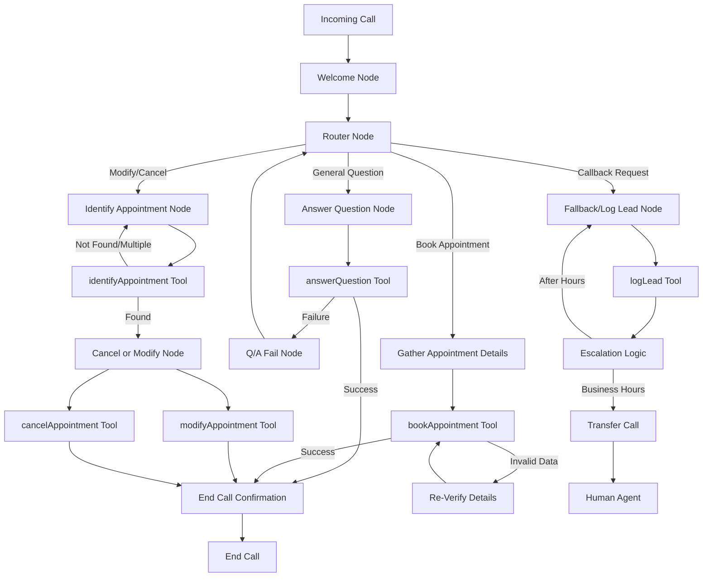

# Layer 7 AI Voice Receptionist Template 🤖

A template repository for creating AI voice receptionist systems with PII protection and automated workflows. Fork this repo for each client deployment.

## 🚀 Build System

This template includes an automated build system that processes configuration files from `src/` to `dist/` for production deployment to Retell AI and N8N.

### Quick Start

```bash
# Install dependencies
npm install

# Build optimized files
npm run build

# Clean build directory
npm run clean

# Format code
npm run format
```

### 📁 Project Structure

```
├── src/                                                    # Source configuration files
│   ├── Layer 7 AI Voice Receptionist (POC) - Retell Agent.json  # Main agent config
│   ├── prompts/                                           # AI prompts & instructions
│   │   ├── Core Prompt.md                                # Main agent instructions
│   │   └── RAG Agent Prompt - answerQuestion.md         # RAG security prompt
│   ├── n8n/                                             # N8N workflow automations
│   │   ├── answerQuestion.json                          # Question handling
│   │   ├── bookAppointment.json                        # Appointment booking
│   │   ├── cancelAppointment.json                      # Appointment cancellation
│   │   ├── identifyAppointment.json                    # Appointment lookup
│   │   ├── logLead.json                                # Lead management
│   │   └── modifyAppointment.json                      # Appointment modification
│   └── secrets/                                         # Client-specific credentials (gitignored)
├── dist/                                                 # Optimized build output (ready for upload)
├── .github/workflows/                                    # CI/CD automation  
│   └── build-deploy.yml                                 # Build & release pipeline
├── build.js                                            # Build system engine
├── package.json                                         # Dependencies & scripts
├── .prettierrc                                         # Code formatting rules
└── .gitignore                                          # Git exclusions
```

### 🍴 Template Repository Workflow

**Fork this repository for each client deployment:**

1. **Fork** → Create client-specific repository  
2. **Customize** → Edit template variables in `src/` with business details
3. **Build** → Run `npm run build` to generate `dist/` files
4. **Deploy** → Upload optimized configs to Retell AI and N8N

#### 🎯 Template Variables to Customize

The agent configuration uses these variables that need client-specific values:

| Variable | Example | Location |
|----------|---------|----------|
| `{{agent_name}}` | "Myra" | Agent JSON, Core Prompt |
| `{{business_name}}` | "Caroline Smith's Salon" | Agent JSON, Core Prompt |  
| `{{ai_support_hours}}` | "24/7" or "Mon-Fri 9am-6pm" | Agent JSON, Core Prompt |

**N8N Workflow URLs** (in agent JSON tools section):
- Update all webhook URLs to your N8N instance
- Configure API endpoints for calendar/CRM integrations
- Set up authentication headers and credentials

## 🔧 Build Features

### ✨ Optimization
- **JSON Minification**: Removes whitespace and formatting from JSON files
- **Markdown Formatting**: Standardizes markdown formatting 
- **Size Reduction**: Typically achieves 30-40% size reduction
- **Build Analytics**: Detailed build statistics and file size reports

### 🔄 CI/CD Pipeline

The project includes GitHub Actions for automated builds and releases:

1. **Build Stage**: 
   - Installs dependencies with `npm install`
   - Runs code formatting with Prettier
   - Builds optimized files with comprehensive scanning
   - Generates detailed build statistics

2. **Release Stage**: 
   - Creates versioned GitHub releases
   - Bundles optimized files as release assets
   - Makes distributions available for download

3. **Optimization Features**:
   - Recursive directory scanning
   - Multi-file type processing (JSON, Markdown)
   - Metadata preservation
   - Error handling for malformed files

### 📊 Build Output

The build process generates:
- **Minified JSON files**: Production-ready configurations
- **Formatted Markdown**: Standardized documentation
- **Build info**: Detailed statistics in `dist/build-info.json`

Example build info:
```json
{
  "buildTime": "2025-10-01T14:35:17.236Z",
  "version": "1.0.0", 
  "stats": {
    "totalFiles": 11,
    "originalSize": "71.19 KB",
    "processedSize": "45.63 KB", 
    "totalReduction": "35.9%",
    "processingTime": "112ms"
  }
}
```

## 🧩 Components & Architecture

### Core Components

#### 🤖 Retell Agent Configuration
- **File**: `Layer 7 AI Voice Receptionist (POC) - Retell Agent.json`
- **Purpose**: Main conversation flow and routing logic
- **Features**: 
  - Multi-step conversation routing
  - Context-aware response handling
  - PII-safe query filtering
  - Tool integration for appointments

#### 📝 Prompt Engineering
- **Directory**: `prompts/`
- **Core Prompt**: System instructions and personality
- **RAG Prompt**: Secure information retrieval guidelines
- **Security Focus**: Prevents data leakage and ensures compliance

#### ⚙️ N8N Workflows
- **Directory**: `n8n/`
- **Functions**: Complete appointment lifecycle management
- **Integrations**: External calendar systems, CRM tools
- **Automation**: Lead capture, booking, modifications, cancellations

### 🔄 Workflow Architecture

Based on the actual agent conversation flow:



**Key Features:**
- **Welcome Flow**: Professional greeting with agent and business name
- **Router-Based Routing**: Intelligent intent detection and conversation routing
- **Multi-Factor Security**: Two-factor authentication for appointment access
- **Error Handling**: Graceful fallbacks for failed operations
- **Human Escalation**: Transfer to live agents during business hours

### 🛠️ Available Scripts

#### Build & Development
| Script | Purpose | Usage |
|--------|---------|-------|
| `npm run build` | Build optimized files | Production deployment |
| `npm run clean` | Remove build artifacts | Clean slate rebuilds |
| `npm run rebuild` | Clean + build | Complete refresh |
| `npm run format` | Format all code | Code consistency |
| `npm run format:check` | Check formatting | CI/CD validation |

#### Version Management & Releases
| Script | Purpose | Usage |
|--------|---------|-------|
| `npm run release:patch` | Release patch version (1.0.0 → 1.0.1) | Bug fixes, small updates |
| `npm run release:minor` | Release minor version (1.0.0 → 1.1.0) | New features, enhancements |
| `npm run release:major` | Release major version (1.0.0 → 2.0.0) | Breaking changes |
| `npm run version:patch` | Bump patch version only | Local version update |
| `npm run version:minor` | Bump minor version only | Local version update |
| `npm run version:major` | Bump major version only | Local version update |

### 📋 Release Management

The template uses **semantic versioning** (SemVer) for clear version management:

#### Creating Releases
```bash
# For bug fixes and small improvements
npm run release:patch

# For new features and enhancements  
npm run release:minor

# For breaking changes or major updates
npm run release:major
```

#### Automatic Release Process
1. **Validates** working directory is clean
2. **Pulls** latest changes from main branch
3. **Runs** build to ensure everything works
4. **Bumps** version in package.json
5. **Updates** build-info.json with new version
6. **Commits** version changes
7. **Creates** and pushes git tag
8. **Triggers** GitHub Actions to create release

#### Version Strategy
- **Patch** (x.x.1): Template bug fixes, prompt improvements, build system fixes
- **Minor** (x.1.x): New conversation flows, additional N8N workflows, feature enhancements  
- **Major** (1.x.x): Breaking changes to template structure, major workflow updates

## 🛡️ Security Features

- **PII Protection**: Router-level filtering prevents exposure of personal data
- **Multi-factor Authentication**: Required for appointment access
- **Secure RAG**: Bulletproof prompts prevent data leakage
- **Secrets Management**: `.gitignore` configured to exclude sensitive files

## 🔗 Resources & Links

### 📁 Repository Access
- **GitHub Repository**: https://github.com/raulduk3/layer7-ai-voice
- **Latest Releases**: https://github.com/raulduk3/layer7-ai-voice/releases
- **Build Artifacts**: Downloadable from releases
- **Actions History**: https://github.com/raulduk3/layer7-ai-voice/actions

### 📊 Monitoring & Analytics
- **Build Statistics**: Available in `dist/build-info.json`
- **Performance Metrics**: File size reductions, processing times
- **Release Tags**: Timestamped versions for tracking
- **Workflow Status**: Real-time CI/CD pipeline monitoring

## 🛠️ Development

### 🚀 Client Setup (Fork This Repository)

1. **Fork Repository**:
   - Click "Fork" on GitHub to create your client-specific copy
   - Clone your fork: `git clone https://github.com/yourusername/client-name-voice-ai.git`

2. **Install Dependencies**:
   ```bash
   cd client-name-voice-ai
   npm install
   ```

3. **Customize Configuration**:
   ```bash
   # Edit main agent config with client details
   nano src/Layer\ 7\ AI\ Voice\ Receptionist\ \(POC\)\ -\ Retell\ Agent.json
   
   # Update business information in prompts
   nano src/prompts/Core\ Prompt.md
   
   # Configure N8N workflow endpoints 
   nano src/n8n/bookAppointment.json  # (and other workflow files)
   ```

4. **Build Optimized Files**:
   ```bash
   npm run build
   # Files ready for upload in dist/ folder
   ```

5. **Deploy to Platforms**:
   - Upload `dist/Layer 7 AI Voice Receptionist (POC) - Retell Agent.json` to Retell AI
   - Import `dist/n8n/*.json` workflows to N8N platform

### 🔧 Adding New Features

#### Extending Build System
The build system supports multiple file types and processing modes:

1. **Add File Type Support**:
   - Modify `scanDirectory()` in `build.js`
   - Add processing logic in `processFile()`
   - Update file extension filters

2. **Custom Optimization**:
   - Extend JSON minification logic
   - Add new Prettier configurations
   - Implement custom file transformations

#### N8N Workflow Development
1. **Create New Workflow**:
   - Design workflow in N8N interface
   - Export as JSON to `n8n/` directory
   - Test integration with agent configuration

2. **Agent Integration**:
   - Add tool definition to agent JSON
   - Configure router edges for new functionality
   - Update security prompts as needed

### 🐛 Troubleshooting

#### Common Issues

| Issue | Cause | Solution |
|-------|-------|----------|
| Build fails | Malformed JSON | Check file syntax, use JSON validator |
| CI/CD errors | Missing dependencies | Verify `package.json` and lock file |
| Large file sizes | No optimization | Ensure Prettier is configured correctly |
| Security warnings | PII exposure | Review router logic and prompts |

#### Debug Commands

```bash
# Validate JSON files
find . -name "*.json" -exec node -e "JSON.parse(require('fs').readFileSync('{}', 'utf8'))" \;

# Check build output
npm run build && ls -la dist/

# Verify formatting
npm run format:check

# Clean rebuild
npm run clean && npm run build
```

### ⚙️ Advanced Configuration

#### Prettier Customization
```json
{
  "semi": false,
  "singleQuote": true,
  "tabWidth": 2,
  "trailingComma": "es5",
  "printWidth": 100
}
```

#### Build Script Options
- **Selective Processing**: Target specific directories
- **Custom Exclusions**: Add to excluded directories list
- **Performance Tuning**: Adjust processing batch sizes

## 🔄 Maintaining Client Forks

### Syncing Template Updates
When the template repository receives improvements:

1. **Add Template Remote**:
   ```bash
   git remote add template https://github.com/raulduk3/layer7-voice-ai-receptionist.git
   git fetch template
   ```

2. **Merge Updates**:
   ```bash
   git merge template/main
   # Resolve any conflicts with your client customizations
   ```

3. **Test & Rebuild**:
   ```bash
   npm run build
   # Verify everything still works with your client config
   ```

## 🤝 Contributing to Template

### Template Improvements
Contributions to improve the base template are welcome:

1. Fork this template repository
2. Make improvements (better prompts, enhanced build system, etc.)
3. Test with `npm run build`
4. Submit Pull Request to help all client deployments

## 📚 Additional Resources

### � Related Documentation
- [Retell AI Documentation](https://docs.retellai.com/)
- [N8N Workflow Documentation](https://docs.n8n.io/)
- [Prettier Configuration Guide](https://prettier.io/docs/en/configuration.html)
- [GitHub Actions Documentation](https://docs.github.com/en/actions)

### 🛟 Support & Community
- **Issues**: [GitHub Issues](https://github.com/raulduk3/layer7-ai-voice/issues)
- **Discussions**: [GitHub Discussions](https://github.com/raulduk3/layer7-ai-voice/discussions)
- **Wiki**: [Project Wiki](https://github.com/raulduk3/layer7-ai-voice/wiki)


## 📄 License

ISC License - See repository for details.

## 🏷️ Version History

See [Releases](https://github.com/raulduk3/layer7-ai-voice/releases) for detailed changelog and version history.

---

**Built with ❤️ for secure, efficient AI voice reception systems.**

*Last updated: October 2025 | Version 1.0.0*